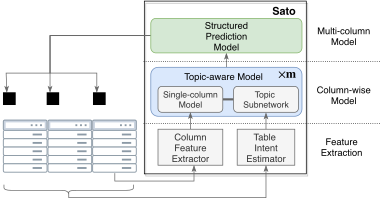
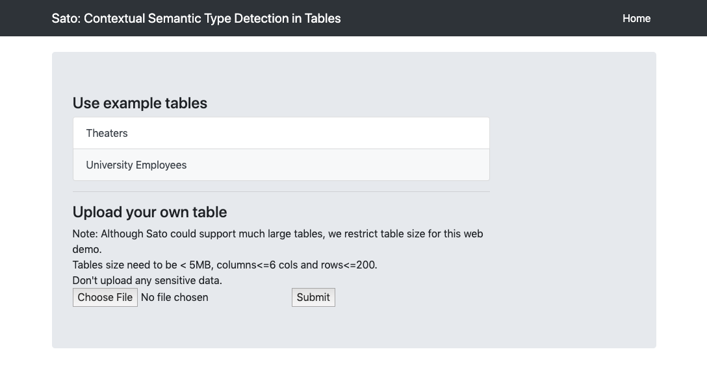
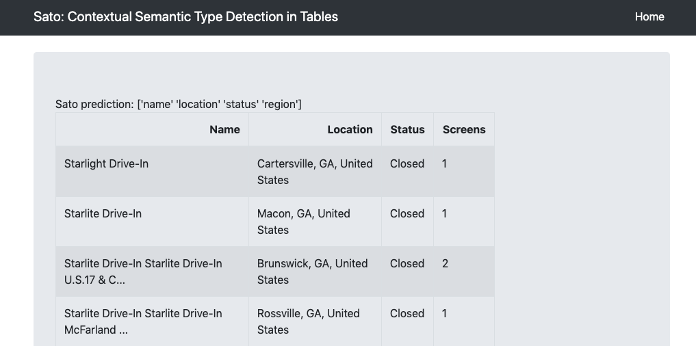

# Sato: Contextual Semantic Type Detection in Tables 
This repository includes source code, scripts, and data for training the **Sato** model.  The repo also includes a pretrained  model to help replicate the results in [our preprint](https://arxiv.org/abs/1911.06311).  Sato is a hybrid machine learning model to automatically detect the semantic types of columns in tables, exploiting the signals from the context as well as the column values. Sato combines a deep learning model trained on a large-scale table corpus with topic modeling and structured prediction. 


Above: Sato architecture. Sato's hyrid architecture consists of two basic modules; a topic-aware single-column prediction module and a structured output prediction module. The topic-aware module extends 
<a href=https://arxiv.org/pdf/1905.10688.pdf>Sherlock</a>'s single-column prediction model (a deep neural network) with additional topic subnetworks, incorporating <em>table intent</em> into the model. The structured output prediction module then combines the topic-aware results for all m columns, providing the final semantic type prediction for the columns in the table.

## What is Sato useful for?
Myriad data preparation and information retrieval tasks, including data cleaning, integration, discovery and search, rely
on the ability to accurately detect data column types. Schema matching for data integration leverages data types to find correspondences between data columns across tables. Similarly, data discovery benefits from detecting types of data
columns in order to return semantically relevant results for user queries. Recognizing the semantics of table values helps aggregate information from multiple tabular data sources. Search engines also rely on the detection of semantically relevant column names to extend support to tables. Natural language based query interfaces for structured data can also benefit from semantic type detection. 


### Demo
We set up a simple online [demo](http://18.191.96.23:5000/) where you can upload small tables and get semantic predictions for column types.




## 
## Environment setup
We recommend using a python virtual environment:
```
mkdir virtualenvs
virtualenv --python=python3 virtualenvs/col2type
```
Fill in and set paths:
```
export BASEPATH=[path to the repo]
# RAW_DIR can be empty if using extracted feature files.
export RAW_DIR=[path to the raw data]
export SHERLOCKPATH=$BASEPATH/sherlock
export EXTRACTPATH=$BASEPATH/extract
export PYTHONPATH=$PYTHONPATH:$SHERLOCKPATH
export PYTHONPATH=$PYTHONPATH:$BASEPATH
export TYPENAME='type78' 

source ~/virtualenvs/col2type/bin/activate
```
Install required packages
```
cd $BASEPATH
pip install -r requirements.txt
```
To specify GPUID, use `CUDA_VISIBLE_DEVICES`. `CUDA_VISIBLE_DEVICES=""` to use CPU.

## Replicating results
Results in the paper can be replicated with and pre-trained models features we extracted.

1. Download data.
`./download_data.sh`
2. Run experiments
`cd $BASEPATH/scripts; ./exp.sh`
3. Generate plots from notebooks/FinalPlotsPaper


##  Additional 
This repo also allows training new Sato models with other hyper-parameters or extract features from additional data.


Download the [VIZNET]([https://github.com/mitmedialab/viznet](https://github.com/mitmedialab/viznet)) data and set RAW_DIR path to location of VIZNET raw data.

### Column feature extraction
```
cd $BASEPATH/extract
python extract_features.py [corpus_chunk] --f sherlock --num_processes [N]
```
corpus_chunk： corpus with potential partition post-fix, e.g. webtables0-p1, plotly-p1
N: number of processes used to extract features

### Table topic feature extraction
Download nltk data
```
import nltk
nltk.download('stopwords')
nltk.download('punkt')
```
[Optional] To train a new LDA model
```
cd topic_model
python train_LDA.py 
```
Extract topic features
```
cd $BASEPATH/extract
python extract_features.py [corpus_chunk] --f topic --LDA [LDA_name] --num_processes [N]
```
corpus_chunk： corpus with potential partition post-fix, e.g. webtables0-p1, plotly-p1
LDA_name: name of LDA model to extract topic features. Models are located in `topic_model/LDA_cache`
N: number of processes used to extract features

The extracted feature files go to `extract/out/features/[TYPENAME]` . 

### Split train/test sets

Split the dataset into training and testing (8/2). 

```
cd $BASEPATH/extract
python split_train_test.py --multi_col_only [m_col] --corpus_list [c_list]
```
m_col:`--multi_col_only` is set, filter the result and remove tables with only one column
c_list: corpus list 

Output is a dictionary with entries ['train','test'].  Dictionary values are lists of `table_id`.


### Train Sato
```
cd $BASEPATH/model
python train_CRF_LC.py -c [config_file]
```
Check out `train_CRF_LC.py` for supported configurations.

## Citing Sato 

Please cite [the arXiv preprint](https://arxiv.org/abs/1911.06311). 

```
@misc{zhang2019sato,
    title={Sato: Contextual Semantic Type Detection in Tables},
    author={Dan Zhang and 
            Yoshihiko Suhara and 
            Jinfeng Li and 
            Madelon Hulsebos and 
            {\c{C}}a{\u{g}}atay Demiralp and 
            Wang-Chiew Tan},
    year={2019},
    eprint={1911.06311},
    archivePrefix={arXiv},
    primaryClass={cs.DB}
}
```

## Contact 

To get help with problems using Sato or replicating our results, please submit a GitHub issue.

For personal communication related to Sato, please contact Dan Zhang (`dzhang@cs.umass.edu`) or 
Çağatay Demiralp (`cagatay@megagon.ai`). 

